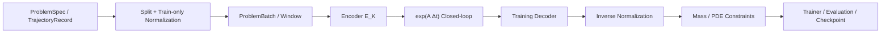

# 截止到 V0.5 的核心知识点学习模块

> 目标：按依赖关系理解 JKA Model 从工程 contract、连续时间 Koopman、学习型表示，
> 到二维 PDE、PhysicsConstraint、训练复现和科学评估的完整路径。

## 0. 总体学习路线

最需要优先掌握的三条主线：

1. 数据、shape 与时间对齐 contract。
2. 连续时间 Koopman 数学及 closed-loop rollout。
3. model-space 学习与 raw-space 物理约束之间的可微链路。



建议每个模块都按以下顺序学习：

```text
测试 → 数据形状与数学公式 → 实现代码 → 运行结果 → 自己修改一个小实验
```

---

## 1. 数据 contract 与时间语义

### 1.1 必须掌握

- 为什么 `T+1` 个状态只能对应 `T` 个时间间隔。
- 为什么 `dt[i]` 属于 `U[i] -> U[i+1]`。
- history、future、action、dt 的切片边界。
- raw state 与 model state 为什么必须同时保留。
- 为什么错误数据不能自动 truncate、padding 或 shift。

唯一合法的轨迹语义：

```text
states:  U[0], U[1], ..., U[T]       长度 T+1
dts:     dt[0], ..., dt[T-1]         长度 T
actions: a[0], ..., a[T-1]           可选，长度 T

U[i] --(a[i], dt[i])--> U[i+1]
```

### 1.2 核心代码

- [`src/jka_model/contracts/batch.py`](../src/jka_model/contracts/batch.py)
  - `validate_trajectory_alignment`
  - `ProblemBatch`
- [`src/jka_model/contracts/spec.py`](../src/jka_model/contracts/spec.py)
  - `GridSpec`
  - `ProblemSpec`
- [`src/jka_model/data/datasets.py`](../src/jka_model/data/datasets.py)
  - `TrajectoryRecord`
- [`src/jka_model/data/windows.py`](../src/jka_model/data/windows.py)
  - `TrajectoryWindowDataset`
  - `collate_problem_batches`

### 1.3 自测题

给定 `history=2, horizon=4`，应能独立写出：

```text
context states: U[t-1], U[t]
history dt:     dt[t-1]

future states:  U[t+1], ..., U[t+4]
future dt:      dt[t], ..., dt[t+3]
```

- [x] 能解释 `ProblemBatch` 中每个 tensor 的 shape。
- [x] 能指出 `future_dts[:, 0]` 对应哪一次状态转移。
- [x] 能构造 negative/zero/wrong-length dt 并说明为何应报错。

---

## 2. 数据泄漏、归一化与可复现 split

### 2.1 必须掌握

- 为什么要按完整 trajectory 划分 train/validation/test。
- 为什么不能先切 window 再随机划分。
- normalizer 为什么只能在 train trajectories 上拟合。
- `sigma + epsilon` 如何避免零方差 channel 产生 NaN/Inf。
- 数据 fingerprint 为什么需要包含状态、dt、参数、网格和 metadata。

### 2.2 核心代码

- [`src/jka_model/data/splits.py`](../src/jka_model/data/splits.py)
- [`src/jka_model/data/normalization.py`](../src/jka_model/data/normalization.py)
- [`src/jka_model/data/fingerprint.py`](../src/jka_model/data/fingerprint.py)

### 2.3 主要审阅问题

> validation/test 的任何信息，是否可能进入 normalizer、训练窗口或 checkpoint selection？

- [ ] 能解释 trajectory-level split 防止了什么泄漏。
- [ ] 能确认 `fitted_trajectory_ids` 只来自 train split。
- [ ] 能说明相同 dataset 为什么应产生相同 fingerprint。

---

## 3. 连续时间 KoopmanCore

这是当前项目最核心的数学模块。

### 3.1 数学模型

\[
\dot z = Az,
\qquad
z(t+\Delta t)=e^{A\Delta t}z(t).
\]

其中：

- `A` 是连续时间生成元。
- `K(dt) = exp(A dt)` 是给定时间间隔下的离散转移矩阵。
- variable-dt 数据对每次转移使用各自的 `exp(A * dt[i])`。

### 3.2 必须掌握

- 连续生成元 `A` 与离散转移矩阵 `K` 的区别。
- 为什么当前模型使用 matrix exponential，而不是 Euler/RK 传播 latent。
- 数学 column vector 与 PyTorch batch row tensor 的转置关系。
- batched variable-dt 的矩阵指数和 `einsum` 语义。
- closed-loop rollout 如何递归使用上一时刻的预测 latent。
- 特征值实部、虚部与衰减/增长、角频率的关系。

### 3.3 核心代码

- [`src/jka_model/models/koopman_core.py`](../src/jka_model/models/koopman_core.py)
- [`src/jka_model/metrics/spectral.py`](../src/jka_model/metrics/spectral.py)
- [`src/jka_model/training/direct_koopman.py`](../src/jka_model/training/direct_koopman.py)
- [`src/jka_model/rollout/koopman_rollout.py`](../src/jka_model/rollout/koopman_rollout.py)

### 3.4 推荐练习

构造：

\[
A=
\begin{bmatrix}
-\gamma&-\omega\\
\omega&-\gamma
\end{bmatrix}.
\]

验证：

- [ ] 特征值为 `-gamma ± i*omega`。
- [ ] 振幅按照 `exp(-gamma*t)` 衰减。
- [ ] 角频率等于 `omega`。
- [ ] 多个 variable-dt step 与相同总时间的解析传播一致。
- [ ] 能解释为什么 row batch 使用 `z @ K.T`。

---

## 4. V0.4：学习 Koopman 表示

V0.4 是从已知物理状态进入 learned latent coordinates 的关键桥梁。

### 4.1 模型链路

\[
x
\xrightarrow{E_K}
z
\xrightarrow{e^{A\Delta t}}
\hat z'
\xrightarrow{D_{train}}
\hat x'.
\]

### 4.2 损失结构

\[
L=
\lambda_KL_K
+\lambda_{multi}L_{multi}
+\lambda_{rec}L_{rec}
+\lambda_{var}L_{var}
+\lambda_{spec}L_{spec}.
\]

需要理解：

- one-step 与 multi-step Koopman loss 的区别。
- multi-step 为什么必须是 closed loop，而不能 teacher forcing。
- reconstruction loss 为什么约束 latent 保留状态信息。
- variance loss 为什么防止 latent collapse。
- stability regularizer 为什么使用 `A + A.T` 的对称部分。

### 4.3 核心代码

- [`src/jka_model/models/koopman_encoder.py`](../src/jka_model/models/koopman_encoder.py)
- [`src/jka_model/models/training_decoder.py`](../src/jka_model/models/training_decoder.py)
- [`src/jka_model/models/koopman_autoencoder.py`](../src/jka_model/models/koopman_autoencoder.py)
- [`src/jka_model/losses/koopman.py`](../src/jka_model/losses/koopman.py)
- [`src/jka_model/training/koopman_representation.py`](../src/jka_model/training/koopman_representation.py)
- [`src/jka_model/data/known_latent.py`](../src/jka_model/data/known_latent.py)

### 4.4 自测题

- [ ] 能画出 encoder/core/decoder 三者的梯度关系。
- [ ] 能解释 future truth 在训练中出现在哪里、不能出现在哪里。
- [ ] 能解释去掉 reconstruction 或 variance 后可能发生什么。
- [ ] 能区分 latent consistency 与 decoded field accuracy。

---

## 5. V0.5：二维解析 PDE 与 field model

### 5.1 参考方程

\[
u_t+c_xu_x+c_yu_y=\nu(u_{xx}+u_{yy}).
\]

单 Fourier 模式中：

\[
\omega=c_xk_x+c_yk_y,
\qquad
\gamma=\nu(k_x^2+k_y^2),
\]

\[
u(x,y,t)=
b+A e^{-\gamma t}
\sin(k_xx+k_yy-\omega t+\phi).
\]

### 5.2 必须掌握

- endpoint-free periodic grid。
- `[T+1,C,Nx,Ny]` 场数据 shape。
- phase、amplitude、mean 如何产生多条轨迹。
- variable-dt 如何生成绝对时间。
- circular padding 为什么是周期拓扑要求。
- encoder 只编码初始场一次，decoder 不负责传播。

### 5.3 核心代码

- [`src/jka_model/data/advection_diffusion_2d.py`](../src/jka_model/data/advection_diffusion_2d.py)
- [`src/jka_model/models/field_koopman_autoencoder.py`](../src/jka_model/models/field_koopman_autoencoder.py)

### 5.4 推荐推导

- [ ] 从 PDE 推导单 Fourier mode 的 `omega`。
- [ ] 推导 decay rate `nu*(kx^2+ky^2)`。
- [ ] 推导质量真值 `M=b*Lx*Ly`。
- [ ] 解释为什么 periodic grid 不重复保存终点。
- [ ] 写出 encoder/core/decoder 的完整 tensor shape 变化。

---

## 6. 空间离散与 PhysicsConstraint

这是 V0.5 数学物理上最需要精读的模块。

### 6.1 二阶中心差分

\[
D_xu_i=
\frac{u_{i+1}-u_{i-1}}{2\Delta x},
\]

\[
D_{xx}u_i=
\frac{u_{i+1}-2u_i+u_{i-1}}{\Delta x^2}.
\]

需要理解：

- `torch.roll` 如何实现周期边界。
- `Dx/Dy/Dxx/Dyy` 的 axis 语义。
- 为什么 reference test 使用 float64。
- observed order 如何验证理论二阶精度。

### 6.2 质量守恒

\[
M(u)=\sum_{i,j}u_{ij}w_{ij},
\]

\[
L_{mass}=
\left(M(\hat u^{n+1})-M(\hat u^n)\right)^2.
\]

### 6.3 PDE operator residual

定义：

\[
F(u)=-c_xu_x-c_yu_y+\nu\Delta u.
\]

梯形离散残差：

\[
r=
\frac{u^{n+1}-u^n}{\Delta t}
-\frac12\left(F(u^n)+F(u^{n+1})\right).
\]

### 6.4 核心代码

- [`src/jka_model/physics/operators.py`](../src/jka_model/physics/operators.py)
- [`src/jka_model/physics/constraints.py`](../src/jka_model/physics/constraints.py)
- [`src/jka_model/losses/field_koopman.py`](../src/jka_model/losses/field_koopman.py)
- [`tests/test_v0_5_data_physics_models.py`](../tests/test_v0_5_data_physics_models.py)

### 6.5 最重要的可微链路

```text
latent rollout
→ decoder
→ model-space field
→ differentiable inverse normalization
→ raw physical field
→ mass/operator loss
→ encoder + decoder + A
```

- [ ] 能复现 `Dx/Dy/Dxx/Dyy` 解析测试。
- [ ] 能计算 32/64/128 网格的 observed order。
- [ ] 能解释 physics 为什么必须在 raw units 中计算。
- [ ] 能只对 `L_physics` 调用 backward 并检查 encoder/decoder/A 梯度。
- [ ] 能解释 AMP 下 physics 与 matrix exponential 为什么保持 FP32。

---

## 7. Problem Adapter 与依赖反转

### 7.1 核心设计

> trainer 不应该知道自己训练的是 advection-diffusion。

Problem Adapter 负责提供：

- `ProblemSpec`
- dataset
- physics constraints
- analytical/reference metrics
- problem description

### 7.2 核心代码

- [`src/jka_model/problems/base.py`](../src/jka_model/problems/base.py)
- [`src/jka_model/problems/registry.py`](../src/jka_model/problems/registry.py)
- [`src/jka_model/problems/advection_diffusion_2d.py`](../src/jka_model/problems/advection_diffusion_2d.py)

### 7.3 学习验收

如果未来替换成二维波动方程，应能够列出需要新增的：

```text
dataset
ProblemSpec
reference metrics
physics constraints
adapter
registry entry
config
```

同时不修改 `train_v0_5()` 的主训练循环。

- [ ] 能解释 Protocol、factory 和 registry 各自的职责。
- [ ] 能解释为什么 loss 接收 constraint mapping，而不自行实例化具体 PDE constraint。
- [ ] 能草拟一个新物理问题 adapter 的类结构。

---

## 8. Canonical trainer、AMP 与训练状态

理解前七个模块后，再精读训练器。

### 8.1 核心代码

- [`src/train/train_v0_5.py`](../src/train/train_v0_5.py)
- [`src/jka_model/training/stages.py`](../src/jka_model/training/stages.py)
- [`scripts/train_v0_5.py`](../scripts/train_v0_5.py)

### 8.2 推荐分段阅读

1. adapter、split、normalizer、window 构建。
2. model、optimizer、scheduler、AMP 初始化。
3. resume 状态恢复。
4. epoch/batch 训练循环。
5. validation、checkpoint selection、evaluation 和 artifact 写入。

### 8.3 必须掌握

- optimizer 是否精确包含所有且仅包含 trainable parameters。
- `TrainStage.KOOPMAN` 当前实际训练哪些模块。
- loss、gradient、parameter 三层 NaN guard。
- physics warm-up 如何产生 `physics_scale`。
- `matrix_exp` 与 physics FP32 precision island。
- `best_forecast` 与 `best_physics` 为什么分开。
- AMP GradScaler 为什么主要针对 FP16。

- [ ] 能沿一次 batch 写出完整 forward/backward 顺序。
- [ ] 能指出 scheduler 在 epoch 中何时更新。
- [ ] 能解释 validation 为什么使用固定、不 shuffle 的 batches。
- [ ] 能说明一次 epoch 保存了哪些 checkpoint 和日志。

---

## 9. Checkpoint、复现与科学评估

这是研究代码区别于普通模型 demo 的重要模块。

### 9.1 核心代码

- [`src/jka_model/utils/checkpoint.py`](../src/jka_model/utils/checkpoint.py)
- [`src/jka_model/utils/seed.py`](../src/jka_model/utils/seed.py)
- [`src/eval/evaluate_v0_5.py`](../src/eval/evaluate_v0_5.py)
- [`tests/test_v0_5_training_resume_evaluation.py`](../tests/test_v0_5_training_resume_evaluation.py)
- [`scripts/inspect_v0_5_run.py`](../scripts/inspect_v0_5_run.py)

### 9.2 必须掌握

- model、optimizer、scheduler、AMP scaler、RNG 为什么都要恢复。
- config hash、data fingerprint、split manifest 为什么必须一致。
- checkpoint 为什么通过临时文件执行原子替换。
- persistence baseline 的物理与统计意义。
- short/medium/long closed-loop 指标。
- learned spectrum 为什么不能依赖 eigenvalue 返回顺序。
- latent non-collapse、mass drift、operator residual 如何共同支持科学判断。

### 9.3 GPU run 学习材料

对已经完成的 GPU run，建议依次阅读：

```text
config/resolved_config.yaml
metadata/run_manifest.json
logs/epoch_metrics.csv
evaluation/final_metrics.json
evaluation/spectrum.json
evaluation/physics_metrics.json
evaluation/baseline_metrics.json
reports/final_report.md
```

重点比较 Physics 与 no-physics 两个正式 run：

- field rollout RMSE
- persistence RMSE
- frequency relative error
- decay relative error
- latent min/max std
- mass drift
- operator residual
- epoch time、samples/s 与 peak VRAM

- [ ] 能验证 uninterrupted/resumed 权重是否完全相同。
- [ ] 能解释为什么 GPU technical PASS 不等于 scientific PASS。
- [ ] 能依据 metrics 独立判断模型是否优于 persistence。
- [ ] 能判断 physics constraint 是否实际改善了物理一致性。

---

## 10. 推荐的完整学习顺序

### Session 1：contract

- `ProblemSpec`
- `TrajectoryRecord`
- `ProblemBatch`
- transition alignment

### Session 2：数据管线

- trajectory split
- train-only normalization
- window/collate
- fingerprint

### Session 3：连续时间 Koopman

- `A`
- `exp(A*dt)`
- variable-dt
- rollout
- spectrum

### Session 4：V0.4 learned representation

- encoder/decoder
- one-step/multi-step/reconstruction/variance/stability loss
- latent collapse

### Session 5：V0.5 二维场

- Fourier analytical solution
- 2-D shapes
- circular CNN
- field rollout

### Session 6：PhysicsConstraint

- finite differences
- grid convergence
- mass conservation
- trapezoidal PDE residual
- physics-only gradients

### Session 7：架构解耦

- Problem Adapter
- registry/factory
- 新问题替换流程

### Session 8：训练与复现

- canonical trainer
- optimizer ownership
- AMP/FP32 islands
- checkpoint/resume
- artifacts

### Session 9：科学评估

- persistence
- short/medium/long rollout
- spectrum/frequency/decay
- latent non-collapse
- physics ablation
- GPU result review

---

## 11. 辅助讲解脚本

```bash
python scripts/explain_v0_2.py
python scripts/explain_v0_3.py
python scripts/explain_v0_4.py
python scripts/explain_v0_5.py
```

建议先读脚本源码，再运行并对照输出。

---

## 12. 暂时不必优先精读

- `src/jka_model/config/schema.py`：先将其视为严格配置字典；用到具体配置时再查。
- `gpu_validation/v0_5/scripts/`：主要是验证与运维，不是模型数学核心。
- `TrainStage.JEPA/RESIDUAL/JOINT`：截止 V0.5 尚未实现对应模型。
- `LatentState.z_r` 和 `TransitionOutput`：属于未来架构 contract，不是当前传播路径。

需要始终记住：

- V0.5 是 Koopman autoencoder + PhysicsConstraint baseline，不是 JEPA。
- latent 使用精确 matrix exponential，不代表 decoded physical field 自动满足 PDE。
- PhysicsConstraint 是可微 soft penalty，不是数值 PDE solver。
- 学到一个看似合理的 spectrum，不等于已经获得可靠的长期预测。
- tiny/smoke PASS 只说明工程链路可运行，不等于 scientific PASS。

---

## 13. 形象理解

`ProblemSpec` 是物理问题的宪法，`ProblemBatch` 是严格编号的货物，
encoder/decoder 是物理空间与 latent 空间之间的翻译器，`exp(A*dt)` 是动力学发动机，
PhysicsConstraint 是物理仪表，trainer 是按固定流程驾驶并记录黑匣子的系统。

学习时应先理解宪法、货物编号和发动机，最后再研究完整驾驶流程。

---

## 14. 个人学习记录

### 已完成

- [ ] Module 1：数据 contract 与时间语义
- [ ] Module 2：split、normalization 与 fingerprint
- [ ] Module 3：ContinuousKoopmanCore
- [ ] Module 4：V0.4 learned representation
- [ ] Module 5：V0.5 二维 PDE 与 field model
- [ ] Module 6：空间算子与 PhysicsConstraint
- [ ] Module 7：Problem Adapter
- [ ] Module 8：canonical trainer 与 AMP
- [ ] Module 9：checkpoint、resume 与 scientific evaluation

### 待进一步研究的问题

1. 
2. 
3. 

### GPU 实验结论

- Commit：
- GPU：
- Physics run：
- No-physics run：
- Resume equality：
- Long rollout vs persistence：
- Frequency relative error：
- Physics ablation conclusion：
- Final technical status：
- Final scientific status：
